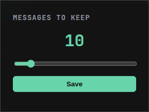

# ChatGPT UI Trimmer

A lightweight browser extension that trims long ChatGPT conversations to keep the UI fast and responsive.

  

## 🚀 What It Does

When a ChatGPT conversation loads, this extension:

- Waits for messages to render (handles React timing)
- Keeps only the latest 10 messages
- Removes older messages from the DOM
- Displays a toast notification indicating whether trimming occurred and how many messages were removed.

This improves browser responsiveness in very long sessions by reducing DOM size.

## 🛠 How It Works

- Injects a content script into ChatGPT
- Uses `MutationObserver` to detect when messages are rendered
- Selects all `div[data-message-author-role]` elements
- Removes older messages while preserving the most recent 10

## 📦 Installation (Developer Mode)

1. Clone this repository
2. Open Edge or Chrome
3. Navigate to:
   - `edge://extensions` or `chrome://extensions`
4. Enable **Developer Mode**
5. Click **Load unpacked**
6. Select the project folder

## 🧠 Why This Exists

Long ChatGPT sessions can cause browser lag due to large DOM trees.  
This extension trims older messages to keep things snappy.

## 🗺 Roadmap / TODO

- [x] Trim messages on conversation load
- [x] Auto-trim continuously when new messages are added
- [x] Make message limit customizable via extension popup
- [x] Improve toast styling

## 🏗 Tech Used

- JavaScript
- Chrome Extension Manifest V3
- DOM APIs
- MutationObserver

---

Built as a learning project while studying web development.
